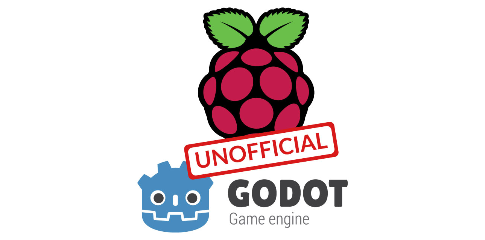

# Unofficial Godot Engine for the Raspberry Pi

Unofficial [Godot Engine](https://godotengine.org/) editor and export templates binaries for the [Raspberry Pi](https://www.raspberrypi.org/).



**NOTES**:

- Currently only the Raspberry Pi 4 is supported. In case you only need to use export templates, you can use the ones from [FRT: a Godot "platform" targeting single board computers](https://github.com/efornara/frt), which offers support for multiple Raspberry Pi revisions.
- The Raspberry Pi only supports GLES2.
- The Raspberry Pi doesn't support GPU particles, only CPU particles.
- We don't have Godot 3.0.6 binaries because it doesn't have GLES2 support, only GLES3.

If you would like official Godot support for the Raspberry Pi, there is [proposal](https://github.com/godotengine/godot-proposals/issues/988) about it. Go there and give us a thumbs up so we can get it 👍 😉 !

## Table of contents

- [Compiling](#compiling)
- [Status](#status)
- [Downloads](#downloads)
- [How to launch the editor (IDE)](#how-to-launch-the-editor-ide)
- [How to export a game using the export templates](#how-to-export-a-game-using-the-export-templates)
- [How to export an independant PCK file](#how-to-export-an-independant-pck-file)
- [How to run a game](#how-to-run-a-game)
- [Troubleshooting](#troubleshooting)

## Compiling

All the binaries are compiled and tested on a non-overcloked Raspberry Pi 4 4GB running [Raspberry Pi OS](https://www.raspberrypi.org/software/operating-systems/), following the [official documentation for compiling Godot in Linux](https://docs.godotengine.org/en/latest/development/compiling/compiling_for_linuxbsd.html).

**NOTES**:

- Up until `3.2.4 beta 4` there was an [audio issue](https://github.com/godotengine/godot/pull/43928) with Godot on a Raspberry Pi. To compile prior versions with the audio issue fixed, all references to `uint8_t` must be changed to `int16_t` in `drivers/alsa/audio_driver_alsa.cpp`.

The SCons parameters and flags used to compile both the editor and the export templates are a mix between [FRT](https://github.com/efornara/frt) by [@efornara](https://github.com/efornara/) and this [blog post](https://bits.p1x.in/raspberry-pi-4-as-perfect-indie-console/) by [@w84death](https://github.com/w84death/).

### Editor (IDE)

```
scons platform=x11 target=release_debug tools=yes use_llvm=yes CCFLAGS="-mtune=cortex-a72 -mcpu=cortex-a72 -mfloat-abi=hard -mlittle-endian -munaligned-access -mfpu=neon-fp-armv8" -j4
```

### Export templates

```
scons platform=x11 target=release tools=no use_llvm=yes CCFLAGS="-mtune=cortex-a72 -mcpu=cortex-a72 -mfloat-abi=hard -mlittle-endian -munaligned-access -mfpu=neon-fp-armv8" -j4
```

### Headless

```
scons platform=server target=release_debug tools=yes use_llvm=yes CCFLAGS="-mtune=cortex-a72 -mcpu=cortex-a72 -mfloat-abi=hard -mlittle-endian -munaligned-access -mfpu=neon-fp-armv8" -j4
```

### Server

```
scons platform=server target=release tools=no use_llvm=yes CCFLAGS="-mtune=cortex-a72 -mcpu=cortex-a72 -mfloat-abi=hard -mlittle-endian -munaligned-access -mfpu=neon-fp-armv8" -j4
```

## Status

|  | 2.1.6 | 3.1.0 | 3.1.1 | 3.1.2 | 3.2.0 | 3.2.1 | 3.2.2 | 3.2.3 | 3.2.4 RC 1 |
|-|:-:|:-:|:-:|:-:|:-:|:-:|:-:|:-:|:-:|
| Editor (IDE) | &#x2713; | \* | \* | \* | \* | \* | \* | \* | &#x2713; |
| Export templates | &#x2713; | &#x2713; | &#x2713; | &#x2713; | &#x2713; | &#x2713; | &#x2713; | &#x2713; | &#x2713; |
| Headless | - | \*\* | \*\* | \*\* | \*\* | \*\* | \*\* | \*\* | \*\* |
| Server | - | \*\* | \*\* | \*\* | \*\* | \*\* | \*\* | \*\* | \*\* |

- &#x2713;: Works perfectly.
- \*: It works, but it's laggy/unresponsive at fullscreen (1920x1200). Making the editor 1/2 or 1/3 of that size makes it run better.
- \*\*: Untested, but should work fine.

## Downloads

### 2.1.6
  - [Editor (IDE)](https://github.com/hiulit/Unofficial-Godot-Engine-Raspberry-Pi/releases/download/v1.2.0/godot_2.1.6_rpi4_editor.zip)
  - [Export template](https://github.com/hiulit/Unofficial-Godot-Engine-Raspberry-Pi/releases/download/v1.2.0/godot_2.1.6_rpi4_export-template.zip)

### 3.1.0
  - [Editor (IDE)](https://github.com/hiulit/Unofficial-Godot-Engine-Raspberry-Pi/releases/download/v1.2.0/godot_3.1.0_rpi4_editor.zip)
  - [Export template](https://github.com/hiulit/Unofficial-Godot-Engine-Raspberry-Pi/releases/download/v1.2.0/godot_3.1.0_rpi4_export-template.zip)
  - [Headless](https://github.com/hiulit/Unofficial-Godot-Engine-Raspberry-Pi/releases/download/v1.2.0/godot_3.1.0_rpi4_headless.zip)
  - [Server](https://github.com/hiulit/Unofficial-Godot-Engine-Raspberry-Pi/releases/download/v1.2.0/godot_3.1.0_rpi4_server.zip)

### 3.1.1
  - [Editor (IDE)](https://github.com/hiulit/Unofficial-Godot-Engine-Raspberry-Pi/releases/download/v1.2.0/godot_3.1.1_rpi4_editor.zip)
  - [Export template](https://github.com/hiulit/Unofficial-Godot-Engine-Raspberry-Pi/releases/download/v1.2.0/godot_3.1.1_rpi4_export-template.zip)
  - [Headless](https://github.com/hiulit/Unofficial-Godot-Engine-Raspberry-Pi/releases/download/v1.2.0/godot_3.1.1_rpi4_headless.zip)
  - [Server](https://github.com/hiulit/Unofficial-Godot-Engine-Raspberry-Pi/releases/download/v1.2.0/godot_3.1.1_rpi4_server.zip)

### 3.1.2
  - [Editor (IDE)](https://github.com/hiulit/Unofficial-Godot-Engine-Raspberry-Pi/releases/download/v1.2.0/godot_3.1.2_rpi4_editor.zip)
  - [Export template](https://github.com/hiulit/Unofficial-Godot-Engine-Raspberry-Pi/releases/download/v1.2.0/godot_3.1.2_rpi4_export-template.zip)
  - [Headless](https://github.com/hiulit/Unofficial-Godot-Engine-Raspberry-Pi/releases/download/v1.2.0/godot_3.1.2_rpi4_headless.zip)
  - [Server](https://github.com/hiulit/Unofficial-Godot-Engine-Raspberry-Pi/releases/download/v1.2.0/godot_3.1.2_rpi4_server.zip)

### 3.2.0
  - [Editor (IDE)](https://github.com/hiulit/Unofficial-Godot-Engine-Raspberry-Pi/releases/download/v1.2.0/godot_3.2.0_rpi4_editor.zip)
  - [Export template](https://github.com/hiulit/Unofficial-Godot-Engine-Raspberry-Pi/releases/download/v1.2.0/godot_3.2.0_rpi4_export-template.zip)
  - [Headless](https://github.com/hiulit/Unofficial-Godot-Engine-Raspberry-Pi/releases/download/v1.2.0/godot_3.2.0_rpi4_headless.zip)
  - [Server](https://github.com/hiulit/Unofficial-Godot-Engine-Raspberry-Pi/releases/download/v1.2.0/godot_3.2.0_rpi4_server.zip)

### 3.2.1
  - [Editor (IDE)](https://github.com/hiulit/Unofficial-Godot-Engine-Raspberry-Pi/releases/download/v1.2.0/godot_3.2.1_rpi4_editor.zip)
  - [Export template](https://github.com/hiulit/Unofficial-Godot-Engine-Raspberry-Pi/releases/download/v1.2.0/godot_3.2.1_rpi4_export-template.zip)
  - [Headless](https://github.com/hiulit/Unofficial-Godot-Engine-Raspberry-Pi/releases/download/v1.2.0/godot_3.2.1_rpi4_headless.zip)
  - [Server](https://github.com/hiulit/Unofficial-Godot-Engine-Raspberry-Pi/releases/download/v1.2.0/godot_3.2.1_rpi4_server.zip)

### 3.2.2
  - [Editor (IDE)](https://github.com/hiulit/Unofficial-Godot-Engine-Raspberry-Pi/releases/download/v1.2.0/godot_3.2.2_rpi4_editor.zip)
  - [Export template](https://github.com/hiulit/Unofficial-Godot-Engine-Raspberry-Pi/releases/download/v1.2.0/godot_3.2.3_rpi4_export-template.zip)
  - [Headless](https://github.com/hiulit/Unofficial-Godot-Engine-Raspberry-Pi/releases/download/v1.2.0/godot_3.2.2_rpi4_headless.zip)
  - [Server](https://github.com/hiulit/Unofficial-Godot-Engine-Raspberry-Pi/releases/download/v1.2.0/godot_3.2.2_rpi4_server.zip)

### 3.2.3
  - [Editor (IDE)](https://github.com/hiulit/Unofficial-Godot-Engine-Raspberry-Pi/releases/download/v1.2.0/godot_3.2.3_rpi4_editor.zip)
  - [Export template](https://github.com/hiulit/Unofficial-Godot-Engine-Raspberry-Pi/releases/download/v1.2.0/godot_3.2.3_rpi4_export-template.zip)
  - [Headless](https://github.com/hiulit/Unofficial-Godot-Engine-Raspberry-Pi/releases/download/v1.2.0/godot_3.2.3_rpi4_headless.zip)
  - [Server](https://github.com/hiulit/Unofficial-Godot-Engine-Raspberry-Pi/releases/download/v1.2.0/godot_3.2.3_rpi4_server.zip)

### 3.2.4 RC 1
  - [Editor (IDE)](https://github.com/hiulit/Unofficial-Godot-Engine-Raspberry-Pi/releases/download/v1.2.0/godot_3.2.4.rc.1_rpi4_editor.zip)
  - [Export template](https://github.com/hiulit/Unofficial-Godot-Engine-Raspberry-Pi/releases/download/v1.2.0/godot_3.2.4.rc.1_rpi4_export-template.zip)
  - [Headless](https://github.com/hiulit/Unofficial-Godot-Engine-Raspberry-Pi/releases/download/v1.2.0/godot_3.2.4.rc.1_rpi4_headless.zip)
  - [Server](https://github.com/hiulit/Unofficial-Godot-Engine-Raspberry-Pi/releases/download/v1.2.0/godot_3.2.4.rc.1_rpi4_server.zip)

## How to launch the Editor (IDE)

To open the editor, run:

```
./godot_x.x.x_rpi4_editor.bin
```

*(where `x.x.x` is the version of Godot)*.

You might need to give executable permissions to the binary. If that's the case, run:

```
sudo chmod +x godot_x.x.x_rpi4_editor.bin
```

## How to export a game using the Export Templates

**NOTES**:

- You don't have to use a Raspberry Pi to export a game for it. You can use any computer running any OS supported by Godot.

### Godot 2.x

- In the editor, go to `Export`.
- Select the `Linux/X11` template.
- In `Debug`, uncheck `Debugging Enabled`.
- In `Custom Binary -> Release`, select the version of the export template that matches the version of your project.
- In `Binary`, uncheck `64 bits`.
- Click `Export`.
- You can use the `.rpi4` extension when naming the exported game.

### Godot 3.x

- In the editor, go to `Project -> Export`.
- Select the `Linux/X11` template.
- In `Binary Format`, uncheck `64 bits`.
- In `Custom template -> Release`, select the version of the export template that matches the version of your project.
- Click `Export Project`.
- Uncheck `Export With Debug`.
- Optionally, after the game is packed, you can rename the extension of the game's executable binary from `.x86` to `.rpi4` to avoid confusion.

## How to export an independant PCK file

You can just export a `.pck` file and run it with the export templates from this repository.

### Godot 2.x

- In the editor, go to `Project -> Export`.
- Select the `Linux/X11` template.
- In `Binary Format`, uncheck `64 bits`.
- Click `Export PCK/Zip`.
- Enter the name of your game with the `.pck` extension.
- Click `OK`.

### Godot 3.x

- In the editor, go to `Project -> Export`.
- Select the `Linux/X11` template.
- In `Binary Format`, uncheck `64 bits`.
- Click `Export PCK/Zip`.
- Uncheck `Export With Debug`.
- Enter the name of your game with the `.pck` extension.
- Click `Save`.

## How to run a game

### Case 1

- The `.pck` file is embedded/compiled in the executable binary.
- The `.pck` file has the same name as the executable binary and they are both in the same directory.

You can just run the executable binary, like this:

```
./name_of_your_godot_game.ext
```

### Case 2

- The `.pck` file has a different name than the executable binary.
- The `.pck` file is in a different directory than the executable binary.
- You are using an independant `.pck` file.

You'll have to pass the `.pck` file's path using the `--main-pack` option, like this:

```
# Using your own exported binary.
./name_of_your_godot_game.ext --main-pack "/path/to/the/pck/file.pck"

# Using the export template binaries from this repository.
./godot_x.x.x_rpi4_export-template.bin --main-pack "/path/to/the/pck/file.pck"
```

## Troubleshooting

### A game doesn't launch or crashes

If the game you are trying to play doesn't work, it will most likely be because it was made with another version of Godot.

It could also be because it uses GDNative or C#, which the Raspberry Pi binaries doesn't support.

### Force Godot to use the GLES2 video render

If you get this error when trying to play a game:

> Your video card driver does not support any of the supported OpenGL versions. Please update your drivers or if you have a very old or integrated GPU upgrade it.

It means that the game you are trying to run uses the GLES3 video driver, which the Raspberri Pi doesn't support. 

You'll have to force Godot to use the GLES3 video driver by passing the `--video-driver GLES2` parameter, like this:

```
# Using your own exported binary.
## Embedded/compiled PCK.
./name_of_your_godot_game.ext --video-driver GLES2
## Independant PCK.
./name_of_your_godot_game.ext --main-pack "/path/to/the/pck/file.pck" --video-driver GLES2

# Using the export template binaries from this repository.
./godot_x.x.x_rpi4_export-template.bin --main-pack "/path/to/the/pck/file.pck" --video-driver GLES2
```

## Changelog

See [CHANGELOG](/CHANGELOG.md).

## Author

Me 😛 [@hiulit](https://github.com/hiulit).

## Credits

Thanks to:

- Juan Linietsky ([@reduz](https://github.com/reduz)), Ariel Manzur ([@punto-](https://github.com/punto-)), Rémi Verschelde ([@akien-mga](https://github.com/akien-mga)) and all the Godot contributors - For creating and maintaining the [Godot Engine](https://github.com/godotengine/godot).
- Emanuele Fornara ([@efornara](https://github.com/efornara)) - For creating [FRT - A Godot "platform" targeting single board computers](https://github.com/efornara/frt).
- Krzysztof Jankowski [@w84death](https://github.com/w84death/) - For the [Raspberry Pi 4 as Perfect Indie Console](https://bits.p1x.in/raspberry-pi-4-as-perfect-indie-console/) blog post.

## LICENSE

- Source code: [MIT License](/LICENSE).
- Godot - Game Engine: [MIT License](/LICENSE_GODOT.txt).
